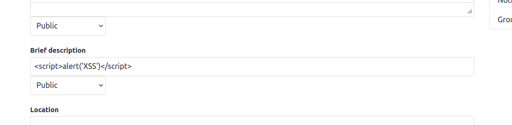
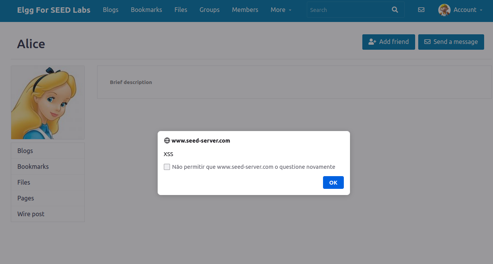
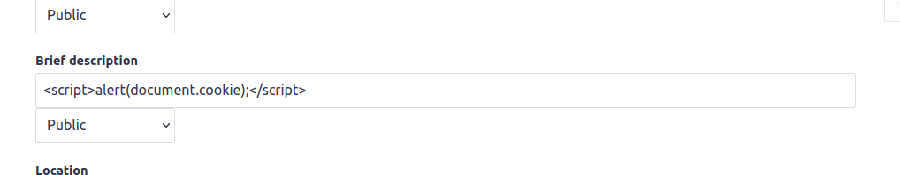
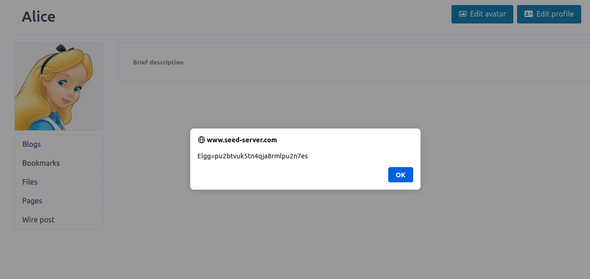

# Trabalho realizado na Semana #10

## **Seed Labs**

## Tarefa 1

Colocando o seguinte script javascript na brief description fazemos com que quem visite o nosso perfil receba um alert.

## Tarefa 2

Colocando o seguinte script javascript na brief description fazemos com que quem visite o nosso perfil receba um alert com as suas cookies.

.png)

## Tarefa 3

